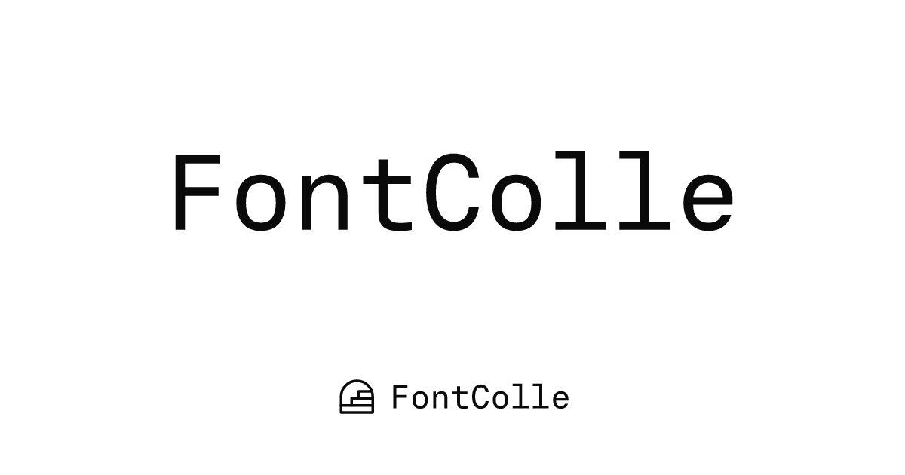

<div align="center">

# FontColle



An enhanced Google Fonts collection that filters OpenType features, variable-font axes, weight/width steps, writing systems, languages, and color vs. monochrome. Preview any weight or named instance live, edit the specimen text inline, and save favorites.


</div>

File-based routing on Cloudflare Workers, with a **static JSON catalog** built from `src/data/fonts.json` and served as CDN-cached assets, with no database (see [Data pipeline](#data-pipeline)). A **Python harvester** (`scripts/harvester`) builds the dataset from the Google Fonts catalog and `gflanguages`.

## Development

```bash
pnpm install
pnpm pull:data    # fetch the data assets from R2 (first clone only)
pnpm dev          # vite dev server on :3000
```

`pnpm pull:data` needs a `CLOUDFLARE_API_TOKEN` with R2 read on the `fontcolle-assets` bucket: see [Data pipeline](#data-pipeline).

`pnpm check` runs Biome (with `--write`) then `tsc --noEmit`; run it before committing. `pnpm build` produces the Workers bundle in `dist/`.

| Script        | What it does                                              |
| ------------- | --------------------------------------------------------- |
| `pnpm dev`    | Local dev server                                          |
| `pnpm build`  | Production build (`scripts/build.mjs` wraps `vite build`) |
| `pnpm check`  | Biome fix + typecheck                                     |
| `pnpm test`   | Vitest                                                    |
| `pnpm gen:og` | Render per-font Open Graph images to `public/og/`         |

The font data is read-only, identical for every visitor, and refreshed once a day, so the app serves it as static JSON rather than querying a database. `pnpm build` slices `src/data/fonts.json` into the files the site fetches (`scripts/gen-catalog.mjs`), so a plain `pnpm dev` / `pnpm build` needs no database setup.

## Data pipeline

### Where the data lives

`fonts.json` (~21 MB), `public/glyphs/` and `public/og/` are too big for git, so they live in the `fontcolle-assets` R2 bucket. Git versions only `src/data/data-manifest.json`, the small, hash-verified pointer to which R2 versions the site ships.

| Command                       | What it does                                            |
| ----------------------------- | ------------------------------------------------------- |
| `pnpm pull:data`              | R2 → local (`scripts/sync-assets.mjs`), verifies sha256 |
| `pnpm publish:assets --daily` | local → R2, bumps the manifest (CI runs this)           |

`pnpm build` calls `sync-assets.mjs` automatically when any of those paths are missing, so a fresh clone (including Cloudflare Workers Builds) self-heals. Trees that already have the files skip the pull.

### Building the dataset

The dataset under `src/data` (`fonts.json`, `languages.json`, `scripts.json`) is generated by the harvester and is the single source of truth:

```bash
python3 scripts/harvester/harvest.py          # fetch + parse font files
python3 scripts/harvester/to_dataset.py ...   # -> src/data/*.json
pnpm build                                    # -> the static catalog below
```

At build time `scripts/gen-catalog.mjs` slices `fonts.json` into the static assets the site serves (all gitignored, regenerated on every build):

| File                         | Who reads it                                                      |
| ---------------------------- | ----------------------------------------------------------------- |
| `public/catalog.json`        | Home page: fetched once on the client, filtered in-browser        |
| `public/catalog/<id>.json`   | Detail page: its SSR loader reads only the one family it renders |
| `public/designer-index.json` | Detail page's About tab: other families by the same designer      |

The detail page reads its per-font file through the Workers `ASSETS` binding on the server and a plain `fetch` on the client, so SSR (and its meta tags) work without pulling in the whole catalog.

`langcov.py` derives language/script coverage and region groupings from `gflanguages`.

### Daily incremental update (CI)

`.github/workflows/daily-harvest.yml` runs at 00:00 UTC (and on demand). Instead of re-harvesting everything, it detects only what changed and updates that subset:

```bash
python3 scripts/harvester/fetch_published.py   # refresh Developer API signals
python3 scripts/harvester/daily_update.py      # harvest new/updated families,
                                               # merge, refresh whole-catalog
                                               # signals -> og_ids.txt
```

New families come from the google/fonts GitHub tree; updated ones from a newer `lastModified`; removed ones are flipped to `isPublished=false`. The workflow then re-renders OG cards for `og_ids.txt`, publishes the new `fonts.json` and changed OG images to R2, commits the bumped `data-manifest.json`, and deploys, so the deploy's `pnpm build` regenerates the static catalog from it. A no-change day is a no-op.

The workflow needs these repository secrets: `GOOGLE_FONTS_API_KEY`, `CLOUDFLARE_API_TOKEN`, `CLOUDFLARE_ACCOUNT_ID`. The token must carry R2 read+write on `fontcolle-assets`: the pull and publish steps fail without it.

## Open Graph images

Each published family has a share card at `public/og/<id>.png` with the family name set **in its own typeface** (traced to a path at build time via the CSS2 API + opentype.js, rasterized with resvg). `pnpm gen:og` renders them all (`--force` re-renders existing; `--ids=<file>` restricts to a subset). The per-font route wires `og:image`; the daily workflow re-renders only changed families and pushes them to R2 as per-object deltas over the base tarball.

## Contribution

Contributions are welcome. Run `pnpm check` before opening a PR.

Font metadata errors (wrong tags, missing languages, bad axis ranges) are best reported as an issue, most trace back to the harvester, not the UI.

## License

MIT, covering this project's own code and metadata index only.

The fonts listed in this project are not distributed here; every font file and download links out to Google Fonts. Each font remains under its own license (SIL Open Font License, Apache 2.0, Ubuntu Font License, etc.) as declared by its original authors and foundries. Check a family's license before using it.